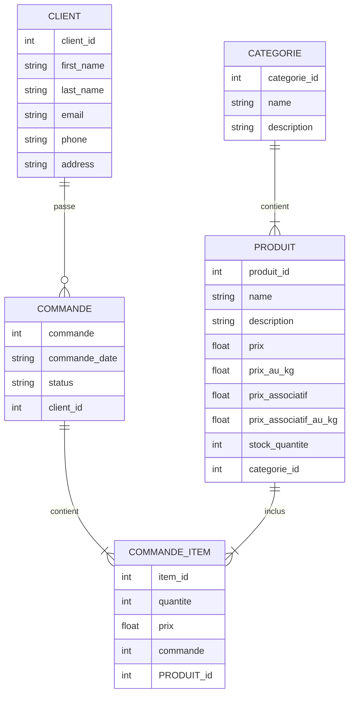

```mermaid
erDiagram
    CLIENT ||--o{ COMMANDE : passe
    COMMANDE ||--|{ COMMANDE_ITEM : contient
    PRODUIT ||--|{ COMMANDE_ITEM : inclus
    CATEGORIE ||--|{ PRODUIT : contient


    CLIENT {
        int client_id
        string first_name
        string last_name
        string email
        string phone
        string address
    }

    COMMANDE {
        int commande
        string commande_date
        string status
        int client_id
    }

    COMMANDE_ITEM {
        int item_id
        int quantite
        float prix
        int commande
        int PRODUIT_id
    }

    PRODUIT {
        int produit_id
        string name
        string description
        float prix
        float prix_au_kg
        float prix_associatif
        float prix_associatif_au_kg
        int stock_quantite
        int categorie_id
    }

    CATEGORIE {
        int categorie_id
        string name
        string description
    }
```