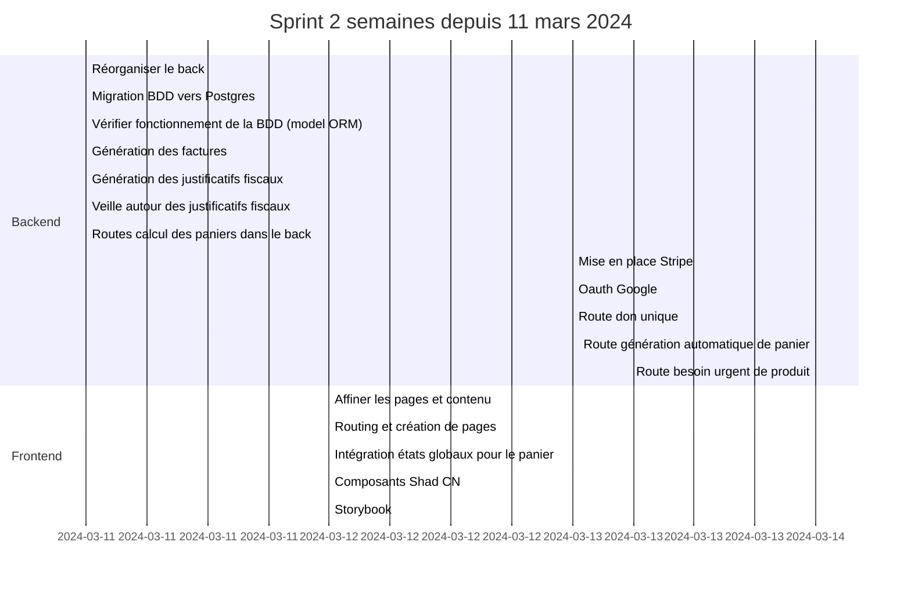
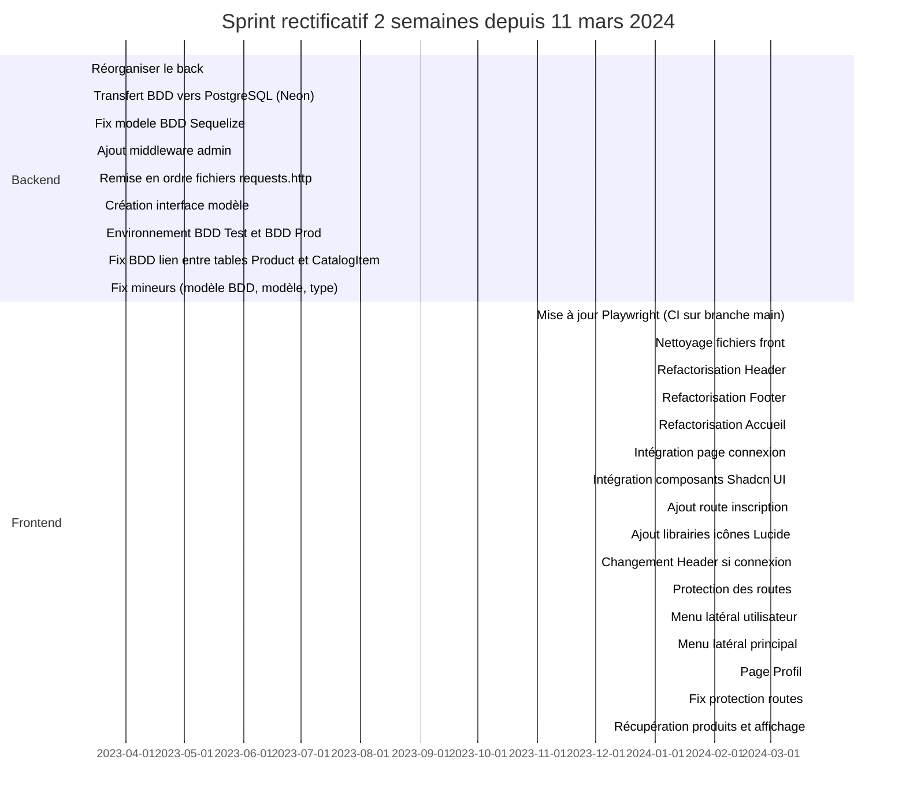

```mermaid
gantt
    title Sprint 2 semaines depuis 11 mars 2024
    dateFormat YYYY-MM-DD

    section Backend
    Réorganiser le back : 2024-03-11,
    Migration BDD vers Postgres : 2024-03-11,
    Vérifier fonctionnement de la BDD (model ORM) : 2024-03-11,
    Génération des factures : 2024-03-11,
    Génération des justificatifs fiscaux : 2024-03-11,
    Veille autour des justificatifs fiscaux : 2024-03-11,
    Routes calcul des paniers dans le back : 2024-03-11,
    Mise en place Stripe : 2024-03-13,
    Oauth Google : 2024-03-13,
    Route don unique : 2024-03-13,
    Route génération automatique de panier : 2024-03-14,
    Route besoin urgent de produit : 202-03-14

    section Frontend
    Affiner les pages et contenu: 2024-03-12,
    Routing et création de pages: 2024-03-12,
    Intégration états globaux pour le panier: 2024-03-12,
    Composants Shad CN : 2024-03-12,
    Storybook : 2024-03-12,

```

```mermaid
gantt
    title Sprint rectificatif 2 semaines depuis 11 mars 2024
    dateFormat YYYY-MM-DD

    section Backend
    Réorganiser le back: 2023-03-11,
    Transfert BDD vers PostgreSQL (Neon) : 2023-03-12,
    Fix modele BDD Sequelize : 2023-03-13,
    Ajout middleware admin : 2023-03-14,
    Remise en ordre fichiers requests.http : 2023-03-15,
    Création interface modèle : 2023-03-18,
    Environnement BDD Test et BDD Prod : 2023-03-19,
    Fix BDD lien entre tables Product et CatalogItem : 2023-03-20,
    Fix mineurs (modèle BDD, modèle, type) : 2023-03-21,

    section Frontend
    Mise à jour Playwright (CI sur branche main): 2024-03-11,
    Nettoyage fichiers front : 2024-03-11,
    Refactorisation Header : 2024-03-12,
    Refactorisation Footer : 2024-03-12,
    Refactorisation Accueil : 2024-03-12,
    Intégration page connexion : 2024-03-12,
    Intégration composants Shadcn UI: 2024-03-12,
    Ajout route inscription : 2024-03-13,
    Ajout librairies icônes Lucide : 2024-03-14,
    Changement Header si connexion : 2024-03-15,
    Protection des routes : 2024-03-15,
    Menu latéral utilisateur : 2024-03-18,
    Menu latéral principal : 2024-03-18,
    Page Profil : 2024-03-20,
    Fix protection routes : 2024-03-21,
    Récupération produits et affichage : 2024-03-22,
```